## 项目简介

《一场》app是我在2017年的时候自己做的一个足球约球App,初期需求由我的朋友“红建”提供并设计整个界面，这里不得不提及一下我的这位朋友，设计思维感觉很前卫，没有他就没有这个项目，感谢他的付出。

>生命中还好有足球相伴，生活常常很疼，伤痕累累，想嚎啕大哭，但它静无声息，所以从不孤单。足球带来荣誉感，归属感，自我价值。球迷和球员对于球队有着强烈的归属感和认同感。与宗教很像，集体带来的认同感和归属感有时确实能克服并超过生死对人的恐惧。并且足球给予球员人生价值的实现机会。一场也应运而生，一场足球，一场朋友。足球除了激情也是抒情一面，一场加入了社交功能，让每个人的足球不孤单。

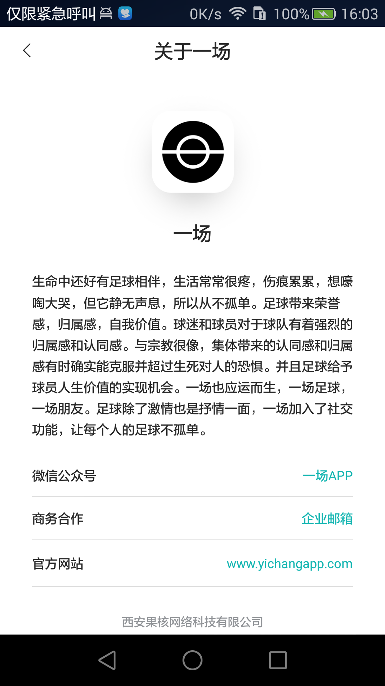

## 项目相关界面截图

由于界面太多，下面截图部分界面

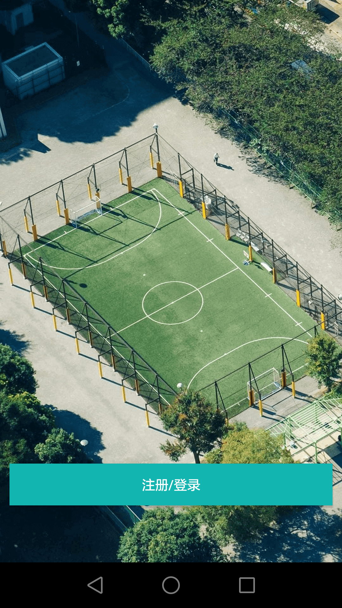

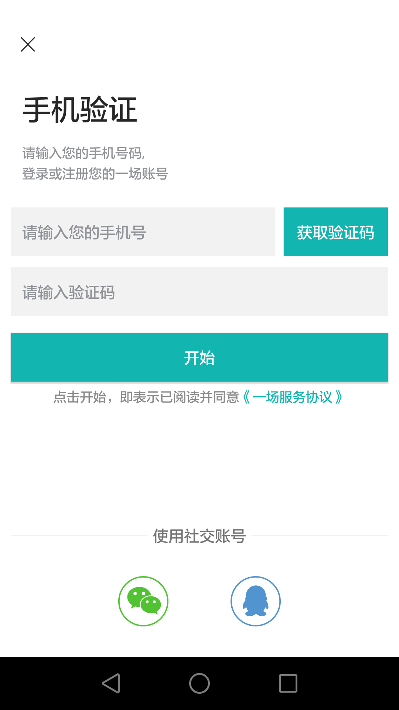

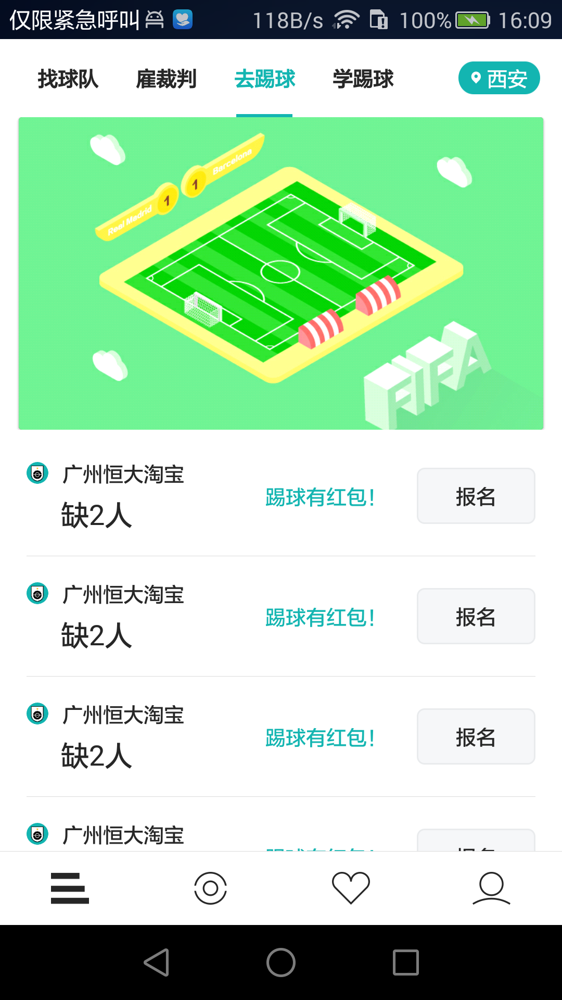

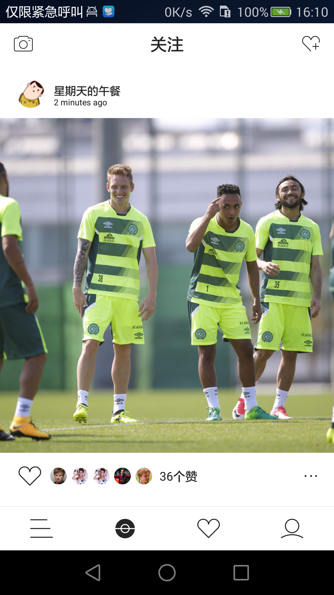

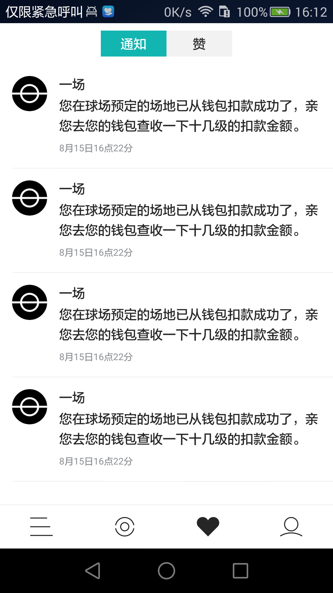

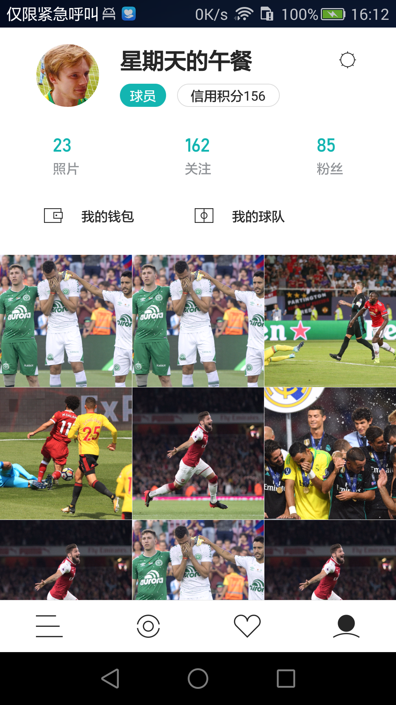

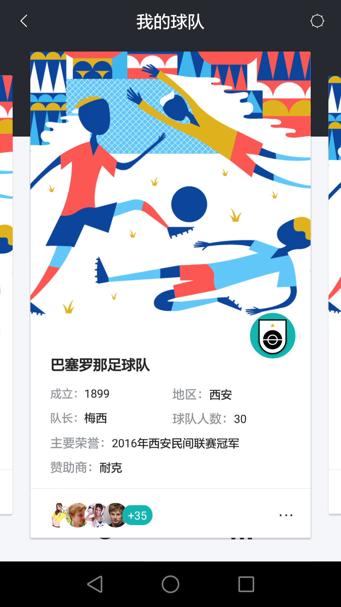

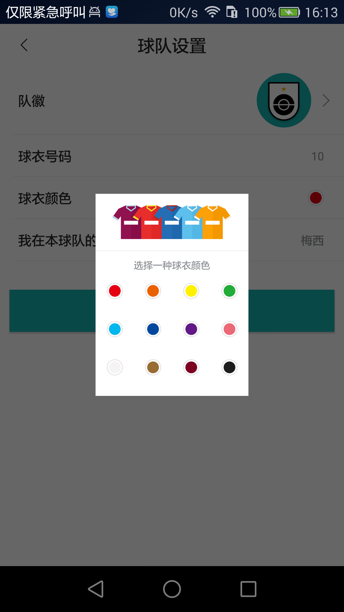

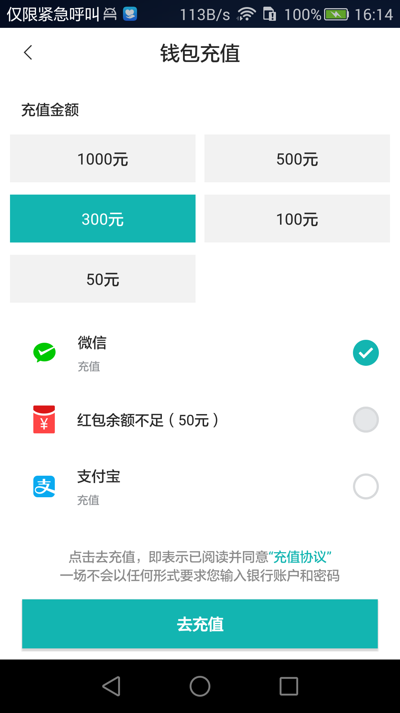

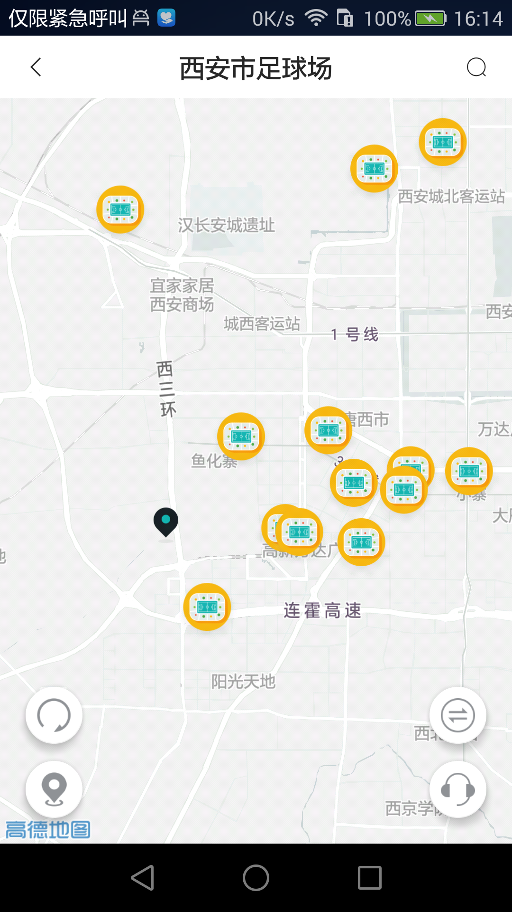

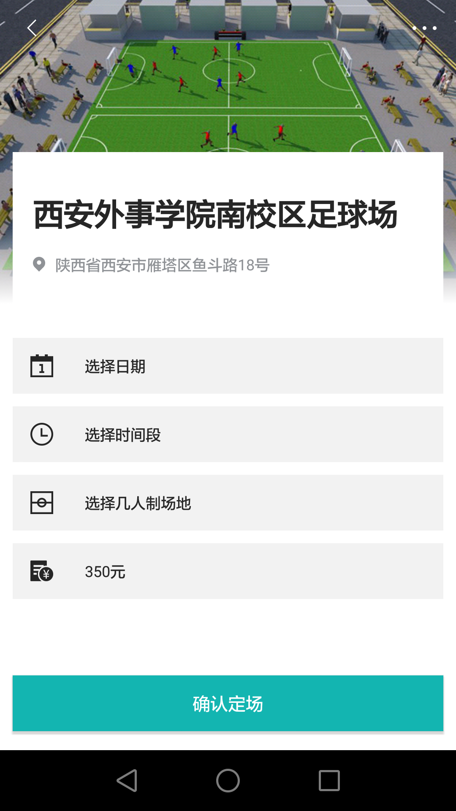